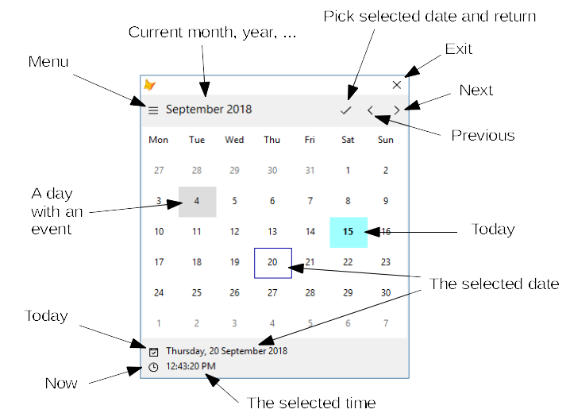

# CalendarCalc Documentation

Go to [Overview](DOCUMENTATION.md "Overview")

## DatePicker Visual Library (beta) ##

The DatePicker Visual Library is a set of visual classes that facilitate the task of date and time selection.

It is composed of

- `textdatepicker`, a textbox control where the picked date, or datetime, will be inserted
- `contdatepicker`, a container to be used in column grids and, or in situations where the textbox may be freely moved around the form
- `formdatepicker`, a form to control the process of date and datetime selection.

The interface mimics most of the features of date selection in W10 machines: the user starts with a month view, and from there he/she may pass to other views (months of the year, years of a decade). Time is selected by setting hours, minutes, seconds, and meridian position.

CalendarCalc classes may be passed to the date picker, and used instead or in addition of the system calendar. If a CalendarCalc is used, events attached to the calendar are displayed in the month view of the calendar.

Further documentation about to follow. Please, refer also to the example form in the [examples](examples.md) page.

### Installation ###

The Visual Library is presented as a [.vc2](datepicker.vc2 ".sc2") FoxBin2Prg document, as the regular combination of [.vcx](datepicker.vcx ".vcx") and [.vct](datepicker.vct ".sct") files, or compressed in a [.zip](datepicker.zip ".zip") file.

In your development system, use whichever form is more convenient for installation.

If no CalendarCalc classes are to be used, you may install and deploy the date picker on its own.

### Regular use ###

In a form, drop a `textdatepicker` control. This will be the target control. You may create as many target controls as needed in the form, and each one of them may be individually prepared.

At design time, the target control has the appearance of a regular textbox. At run time, a label will be created on the right: if the user clicks on it, or double clicks on the textbox, a `formdatepicker` will popup for date or datetime selection.

The target control's value or control source must be of date or datetime type. Other than that, format the date as required, except by setting it to long or short formats, which are not supported.

You may set `.IsDatetime` to force the time portion of a date to be picked up, also.

For datetime, target control's `.Hours` and `.Seconds` properties have impact on how time portion is picked by the date picker form. Depending on how they are set, and eventually on the values of `SET("Hours")` and `SET("Seconds")`, time selection may or may not use a 24 hour selection, or may or may not require seconds portion selection.

### Using with CalendarCalc classes ###

CalendarCalc classes may be used for calendar visualization, instead of or in addition to the system calendar, based on VFP's built-in date and time functions and types.

The CalendarCalc classes are set in the `.Calendars` property of the target control, which must point to a Collection of CalendarCalc classes, keyed by some name that will allow their identification in a menu.

For instance, to prepare a date picker with Jewish calendar, in addition to VFP's system calendar, place on the `SetCalendars()` method of the target control,

```foxpro
DO LOCFILE("hebrew-calendar.prg")

This.Calendars = CREATEOBJECT("Collection")

This.Calendars.Add(CREATEOBJECT("HebrewCalendar"), "Hebrew")
```

Other required calendars will just have to be added to the collection. Note that the calendars Collection and its members do not have to be created in every instance of the target control: it may be a form property or some object that is in scope, for instance.

The default calendar to be used by the date picker form may be set in target control's `.CalendarIndex` property. It defaults to 0, which means the system calendar, but may be set to one of the calendars in the collection (1 to `.Calendars.Count`).

You may inhibit the use of the system calendar by setting `.NoSystemCalendar` to .T. In this case, only the calendar(s) in the collection will be used.

Events attached to any calendar will be shown in the month view of the date picker form, by greying its tile (actually, the color is set by the form's `.EventBackColor` property) and by tooltiping the event description.

No matter what calendar was used to pick the date, it will always be returned as a date or datetime value, by setting the target control's `.Value` property. Use CalendarCalc conversion methods to have this value transposed to any other calendar.

### User interface

The main components of the user interface are identified in the following image:

